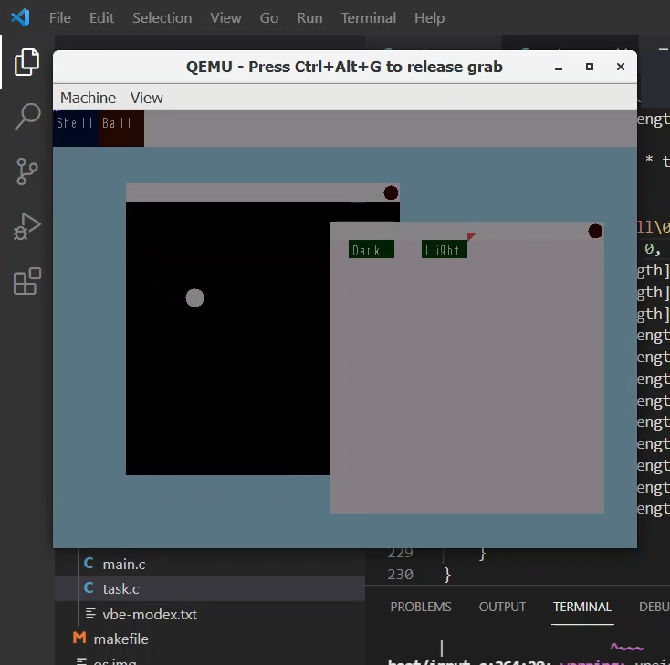
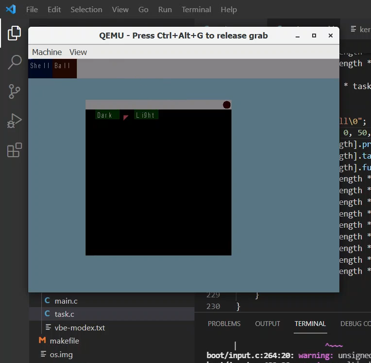

<div align="center">

# 🧠 Simple 32-bit Operating System

## Bootable OS written in C and x86 Assembly — built to learn the fundamentals of low-level systems and how real kernels work.


</div>

---

<div align="center">
  <!-- Replace with your actual paths if adding screenshots -->
  
   
</div>

---

## 📘 About

This project is a graphical 32-bit operating system built completely from scratch using NASM and C. It features a 16-bit bootloader, a C-based kernel, basic memory management, hardware-level keyboard/mouse input, double-buffered graphics, and cooperative multitasking. The OS runs entirely on bare-metal and is tested with QEMU.

---

## 🛠️ What’s Inside

- ✅ 16-bit bootloader written in Assembly that switches to protected mode
- ✅ C-based kernel loaded and executed with memory management setup
- ✅ Direct VGA memory access to display text and graphics
- ✅ Real-time hardware I/O handling (keyboard + mouse) using interrupts
- ✅ Double-buffered graphics for smooth animation rendering
- ✅ Cooperative multitasking (bouncing ball demo, etc.)
- ✅ Fully bootable `.img` file tested via QEMU

---

## 💡 What I Learned

- How x86 CPU boots and switches modes (real → protected)
- How bootloaders are written in NASM and assembled into raw binaries
- How a kernel is compiled with `gcc` and linked properly with a linker script
- How interrupts and hardware I/O are handled at the OS level
- How to build multitasking systems and basic window elements from scratch

---

## 🚀 Getting Started

### 🔧 Prerequisites

- [NASM](https://www.nasm.us/)
- [GCC](https://gcc.gnu.org/)
- [QEMU](https://www.qemu.org/)
- `make`

**_1. Build the OS_**

```bash
make
```

**_2. Run using QEMU_**

```bash
qemu-system-i386 -fda os.img
```

**_3. Clean Build_**

```bash
make clean
```

> Removes all object files and the generated image.

---

## 📦 Final Output

- The final output is a bootable floppy image os.img that can be run in any x86 emulator like QEMU or Bochs.

## Project Structure

```bash
/os
├── os.img                    # Bootable OS image (generated by make)
├── os.img.lock               # Lock file (ignored, auto-generated)
├── boot/
│   ├── bin/                  # Compiled binaries or utility executables
│   ├── images/               # Assets such as bitmaps or font data
│   ├── utilities/            # Helper functions or misc modules
│   ├── boot.asm              # 16-bit bootloader to enter protected mode
│   ├── final.c               # Optional final demo or integration logic
│   ├── font.c                # Bitmap font rendering (character drawing)
│   ├── graphics.c            # Core graphics logic (pixel-based drawing)
│   ├── graphics_elements.c   # High-level UI elements (windows, boxes)
│   ├── graphics.h            # Header file for graphics functions
│   ├── input.c               # Keyboard and mouse I/O via interrupts
│   ├── kernel_entry.asm      # ASM setup for C kernel handoff
│   ├── main.c                # Kernel main loop and boot logic
│   ├── makefile              # Build instructions (NASM + GCC + LD)
│   ├── README.md             # Project documentation
│   ├── task.c                # Cooperative multitasking (e.g., ball demo)
│   └── vbe-modex.txt         # VESA video mode config / test output
```
